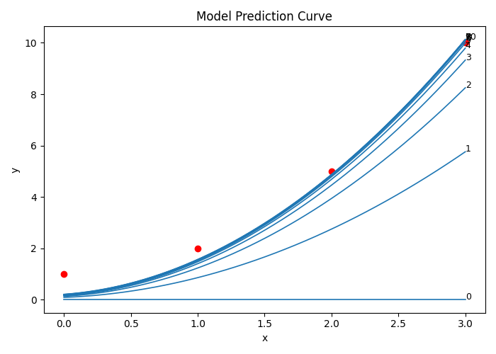
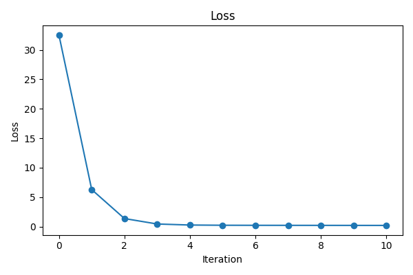
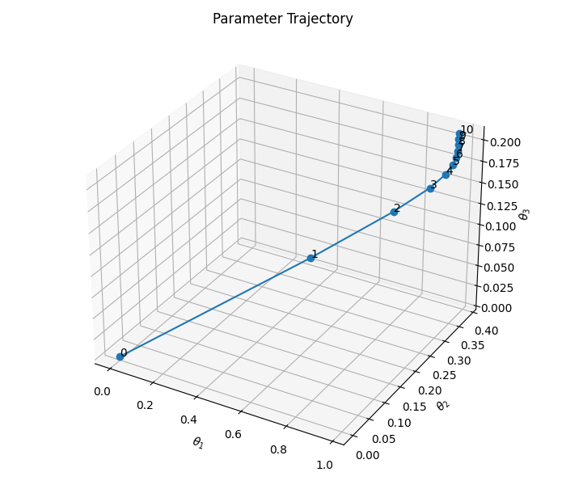
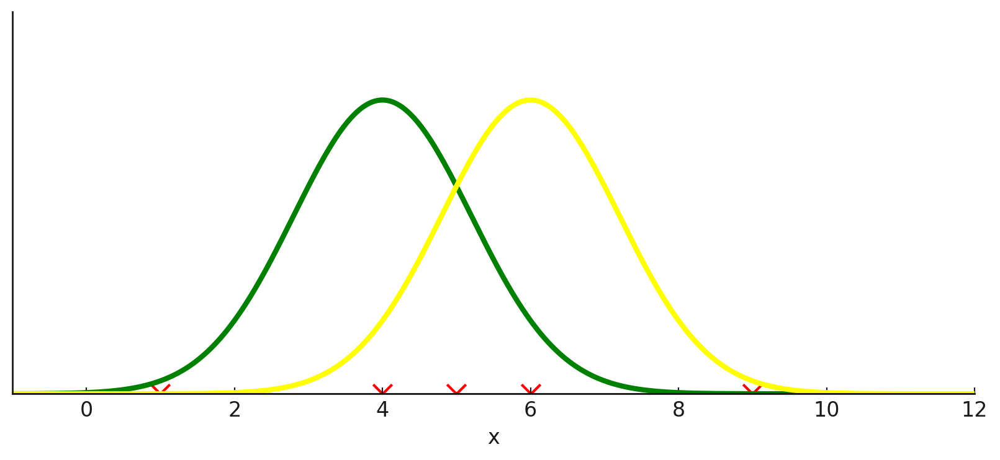
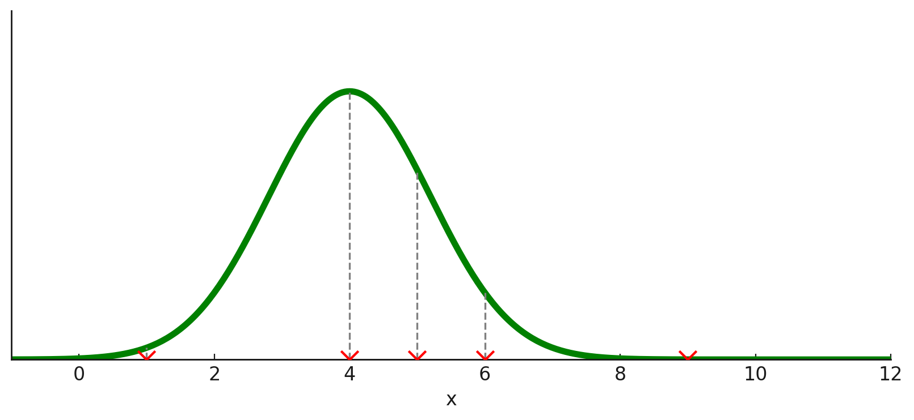

# Mathematical Foundations of Machine Learning
The goal of this post is to interpret the theoretical foundations of ML from the perspectives of optimization and probability models.

# 1. Background of Optimization
Training a model in ML can be viewed as a special form of an optimization problem. Thus, we first provide a brief explanation of the basic concepts in optimization theory.

> **Definition of optimization**:  Optimization theory is the branch of mathematics that studies methods for finding the best solution to a problem from all feasible solutions according to a given objective [1].

Optimization problems are generally divided into convex and non-convex optimization. Although ML are inherently non-convex, we assume an unconstrained convex optimization setting to explain the intuition and principles of ML more clearly.

## 1.1. Basic definiction of optimization problems
In typical optimization theory, a specific problem is expressed as an objective function  $f(x)$, and the goal is to find the maximum or minimum value of this objective function. When there are no constraints, the optimization problem can be defined as follows:

$$
\min_{x \in \mathbb{R}^n} f(x)
$$

If we let $f(x) = x^2$, our goal is to find the point where $x^2$ attains its minimum value. Here, $x$ is called the decision variable. When the objective function is simple, as in this example, we can derive a closed-form. Specifically, since the derivative is $2x$, the function reaches its minimum when $x = 0$. (We take the derivative because, for smooth functions, the gradient is zero at a minimum or maximum point. Of course, closed-form solutions can also be obtained by other methods—such as algebraic manipulation, geometric reasoning, or using subgradients.)

## 1.2. Gradient Descent
However, let us assume that the objective function in the example does not have a closed form. When solving an unconstrained optimization problem without a closed-form solution, we typically use gradient descent (GD). GD is useful because it does not require knowledge of the entire shape of the function. It only requires that we can compute the gradient at the current point.

### 1.2.1. Definition of gradient descent

$$  
\text{Given } f: \mathbb{R}^n \to \mathbb{R},  
\quad x_{k+1} = x_k - \eta \nabla f(x_k),  
\quad \eta > 0.  
$$

- $x_k$: variable vector at the $k$-th iteration
- $\eta$: learning rate, step size
- $\nabla f(x_k)$: gradient of the objective function $f$ at $x_k$

GD is an optimization algorithm that minimizes a given objective function $f: \mathbb{R}^n \to \mathbb{R}$ by iteratively updating the variable in the direction that decreases the function value, guided by the gradient. The gradient $\nabla f(x_k)$ represents the direction of steepest ascent. Therefore, to find a minimum, we proceed in the opposite direction. **An important point about GD is that updates are not computed directly from the value of $f(x)$, but rather from the direction determined by the gradient $\nabla f(x_k)$ and the step size $\eta$, which specifies how far to move.**

### 1.2.2. Example of GD
Consider the objective function  $f(x) = x^2,$ whose derivative (gradient in 1D) is $\nabla f(x) = f'(x) = 2x$. In this example, we assume that the closed form of $x^2$ is not available. We apply Gradient Descent with learning rate $\eta = 0.1$, using the update rule:

$$ 
x_{k+1} = x_k - \eta \nabla f(x_k)= x_k - 0.1 \cdot (2x_k)= 0.8 x_k.
$$

Let the initial point be $x_0 = 2$.  
The following table shows the first 5 iterations of gradient descent.

| k | x_k     | Gradient  | Update    | f(x_k) |
|---|---------|-------------------|-----------------------------------------|---------------------|
| 0 | 2.0     | 4.0               | 2.0 − 0.4 = 1.6                         | 4.0                 |
| 1 | 1.6     | 3.2               | 1.6 − 0.32 = 1.28                       | 2.56                |
| 2 | 1.28    | 2.56              | 1.28 − 0.256 = 1.024                    | 1.6384              |
| 3 | 1.024   | 2.048             | 1.024 − 0.2048 = 0.8192                 | 1.048576            |
| 4 | 0.8192  | 1.6384            | 0.8192 − 0.16384 = 0.65536              | 0.67108864          |
| 5 | 0.65536 | 1.31072           | 0.65536 − 0.131072 = 0.524288           | 0.4294967296        |

<br>

**Additional remarks on GD**
GD is an algorithm that minimizes a scalar objective function $f: \mathbb{R}^n \to \mathbb{R}$. A single notion of “smaller” is defined only when the output is a scalar, and the descent direction of the gradient is also meaningful in that case. In contrast, if the function outputs a vector, such as $f: \mathbb{R}^n \to \mathbb{R}^m$, each component represents a different objective, resulting in a multi-objective optimization problem.

## 1.3. Gradient Descent from Taylor Expansion (optional)

Gradient Descent is derived from the first-order Taylor approximation, where $-\nabla f$ represents the direction of maximum decrease. To understand this, we revisit the Taylor expansion.

> **Definition of Taylor expansion**: The Taylor series or Taylor expansion of a function is an infinite sum of terms expressed in terms of the function’s derivatives at a single point [2]. In other words, it provides a polynomial approximation of the function near that point.

$$
\begin{align}  
f(x) &= f(a) + f'(a)(x-a) + \frac{f''(a)}{2!}(x-a)^2 + \frac{f^{(3)}(a)}{3!}(x-a)^3 + \cdots \  
&= \sum_{n=0}^{\infty} \frac{f^{(n)}(a)}{n!} (x-a)^n  
\end{align}  
$$

Gradient Descent is derived by noting that the first-order Taylor approximation of the objective function $f:\mathbb{R}^n\to\mathbb{R}$ near a point shows that the direction of steepest descent is $-\nabla f$.

Near the current point $x_k$, the first- and second-order Taylor approximations of $f$ are:

$$
\begin{aligned}
f(x_k + \Delta)
&\approx f(x_k) + \nabla f(x_k)^\top \Delta, \\
f(x_k + \Delta)
&\approx f(x_k) + \nabla f(x_k)^\top \Delta
    + \frac{1}{2}\Delta^\top H_k \Delta,
\end{aligned}
$$

where $H_k$ is the Hessian matrix of $f$ at $x_k$.

For small updates $\Delta$, the first-order term dominates, so

$$
f(x_k + \Delta) - f(x_k)  
\approx \Delta f  
= \nabla f(x_k)^\top \Delta.  
$$

To decrease $f$, we need $\Delta f < 0$, which means we must choose $\Delta$ such that  
$\nabla f(x_k)^\top \Delta$ is negative.  Therefore, $\Delta$ must point in the opposite direction of the gradient:

$$
\Delta \propto -\nabla f(x_k).  
$$

Introducing a learning rate $\eta > 0$, we set $\Delta = -\eta \nabla f(x_k),$ and the Gradient Descent update becomes:

$$
x_{k+1} = x_k + \Delta  
= x_k - \eta \nabla f(x_k).  
$$

Based on the first-order approximation, the decrease in the function value is

$$
\Delta f  
\approx \nabla f(x_k)^\top (-\eta \nabla f(x_k))  
= -\eta |\nabla f(x_k)|^2 < 0.  
$$

Thus, Gradient Descent always updates the parameters in a direction that decreases $f$.

**PS.** If we use the second-order approximation (Newton’s Method), the curvature information (second derivative) allows the algorithm to detect directions that go downhill even when the first derivative is zero. This helps avoid getting stuck at saddle points. However, due to computational cost, most machine learning methods rely only on the first-order approximation.

<br>

# 2. Machine Learning from optimization persepctive
Let us redefine model training in ML from the viewpoint of optimization. The goal of machine learning is to make the model represent the underlying data distribution well. Therefore, the objective is to reduce the loss between the real data and the model’s output. Consider a dataset $D={(x_i, y_i)}^{n}_{i=1}$ and a model $f_{\theta}(x):\theta_1 x^2+\theta_2 x + \theta_3$ . Using the Mean Squared Error (MSE) loss $L(\theta)=\frac{1}{n}\sum^{n}_{i=1}(\hat{y}_i-y_i)^2$, the optimization problem is defined as follows:

$$
\min_{\theta_1,\theta_2,\theta_3\in\mathbb{R}} \frac{1}{n}\sum^{n}_{i=1}(\theta_1 x^2 + \theta_2 x + \theta_3-y_i)^2
$$

In other words, the goal is to minimize the average loss over all data points. Just like the previous GD example where we updated $x$ to find the minimum of $f(x)$, we update $\theta$ in the direction that reduces the gradient of the loss, and continue GD until the loss becomes no longer decreases.

## 2.1. Machine learning with gradient descent
Let's examine the training process with an example. To apply Gradient Descent, we first need to differentiate the model. Given the model $\hat{y} = \theta_1 x^2 + \theta_2 x + \theta_3$ and the basis vector $[x^2, \; x, \; 1]^\top$, we can express the system for a dataset $D$ as follows:

$$
\hat{\mathbf{y}} =
\begin{bmatrix}
\hat{y}_1\\ \vdots\\ \hat{y}_n
\end{bmatrix}= X\theta
$$  

where $X$ is the design matrix:

$$
X =
\begin{bmatrix}
x_1^2 & x_1 & 1 \\
\vdots & \vdots & \vdots \\
x_n^2 & x_n & 1
\end{bmatrix} \in \mathbb{R}^{n\times 3},
\quad
\theta =
\begin{bmatrix}
\theta_1 \\
\theta_2 \\
\theta_3
\end{bmatrix} \in \mathbb{R}^{3\times 1},
\quad
y =
\begin{bmatrix}
y_1 \\
\vdots \\
y_n
\end{bmatrix} \in \mathbb{R}^{n\times 1}.
$$

Thus, the objective function (loss function) is defined as:  

$$
\begin{align}
L(\theta) &= \frac{1}{n}\sum^{n}_{i=1}(\hat{y}_i-y_i)^2=\frac{1}{n}\|X\theta-y\|^2_2\\
&= \frac{1}{n}(X\theta-y)^\top(X\theta-y)\\
&= \frac{1}{n}(X\theta)^\top(X\theta)-(X\theta)^\top y-y^\top(X\theta)+y^\top y \\
&= \frac{1}{n}\theta^\top X^\top X\theta-\theta^\top X^\top y-y^\top X\theta+y^\top y\\
&= \frac{1}{n}\theta^\top X^\top X\theta-2y^\top X\theta+y^\top y
\end{align}
$$

+ line 3 $\rightarrow$ 4: expanding the inner product and changing multiplication order  
+ line 4 $\rightarrow$ 5: since the result is a scalar, the order can be rearranged. 

Differentiating the objective function:  

$$
\nabla_{\theta} L(\theta) = \frac{1}{n} \left( 2X^\top X\theta - 2X^\top y \right) = \frac{2}{n} X^\top (X\theta - y)
$$

Thus, the GD update rule is:  

$$ 
\theta_{k+1} = \theta_k - \eta \nabla_{\theta} L(\theta_k)  
= \theta_k - \eta \cdot \frac{2}{n} X^\top (X\theta_k - y) 
$$


## 2.2. Proof of Differentiation rules (optional)

### 2.2.1. Scalar Transpose

**Assumption**

Let the dimensions of the matrix and vectors be defined as follows:
 - $X \in \mathbb{R}^{n \times p}$
 - $\theta \in \mathbb{R}^{p \times 1}$ (or simply $\mathbb{R}^p$)
 - $y \in \mathbb{R}^{n \times 1}$ (or simply $\mathbb{R}^n$)   

**Claim**

$$
\theta^\top X^\top y = y^\top X \theta
$$


**Proof**

_Dimensional Analysis_ | first, we analyze the dimensions of the term $y^\top X \theta$: 

$$
\underbrace{y^\top}_{(1 \times n)} \times \underbrace{X}_{(n \times p)} \times \underbrace{\theta}_{(p \times 1)} \rightarrow (1 \times p) \times (p \times 1) \rightarrow (1 \times 1)
$$

Since the result is a $1 \times 1$ matrix, let $s = y^\top X \theta$, where $s$ is a scalar. 

_Property of Scalars_ | For any scalar $s \in \mathbb{R}$, the transpose of the scalar is equal to itself: 

$$
s^\top = s
$$

_Application of Transpose Properties_ | By applying the transpose operation to $s$ (using the property $(ABC)^\top = C^\top B^\top A^\top$), we get:

$$
\begin{aligned} s^\top &= (y^\top X \theta)^\top \\ &= \theta^\top X^\top (y^\top)^\top \\ &= \theta^\top X^\top y \end{aligned}
$$

_Conclusion_ | Since $s = s^\top$, it follows that: 

$$
y^\top X \theta = \theta^\top X^\top y
$$

### 2.2.2. Derivative of Quadratic Form

**Assumption**

Let vectors and matrices be defined as follows:
- $\theta \in \mathbb{R}^n$ is a column vector.
- $A \in \mathbb{R}^{n \times n}$ is a square matrix (not necessarily symmetric yet).
- $f(\theta) = \theta^\top A \theta$ is a scalar function (Quadratic Form).

**Claim**

The gradient of $f(\theta)$ with respect to $\theta$ is:

$$
\nabla_{\theta}(\theta^\top A\theta) = (A + A^\top)\theta
$$

(Corollary: If $A$ is symmetric, i.e., $A = A^\top$, then $\nabla_{\theta} f = 2A\theta$.)

**Proof**

_Perturbation_ | Consider a small change $d\theta$ in $\theta$. We evaluate the function at $\theta + d\theta$:

$$
f(\theta + d\theta) = (\theta + d\theta)^\top A (\theta + d\theta)
$$

_Expansion_ | Distribute the terms:

$$
\begin{aligned} f(\theta + d\theta) &= (\theta^\top + d\theta^\top) A (\theta + d\theta) \\ &= \underbrace{\theta^\top A \theta}_{\text{original } f(\theta)} + (d\theta)^\top A \theta + \theta^\top A d\theta + \underbrace{(d\theta)^\top A d\theta}_{\text{higher-order term}} \end{aligned}
$$

_Total Differential_ | The total differential $df$ consists of the linear terms in $d\theta$. The term $(d\theta)^\top A d\theta$ is second-order (quadratic in $d\theta$), so it approaches 0 faster than $d\theta$. Thus, we ignore it for the first derivative:

$$
df \approx (d\theta)^\top A \theta + \theta^\top A d\theta
$$

_Scalar Transpose Property_ | Note that $(d\theta)^\top A \theta$ results in a scalar. A scalar is equal to its transpose ($s = s^\top$). Thus:

$$
(d\theta)^\top A \theta = \left( (d\theta)^\top A \theta \right)^\top = \theta^\top A^\top d\theta
$$

_Substitution and Factoring_ | Substitute this back into the expression for $df$:

$$
\begin{aligned} df &= \theta^\top A^\top d\theta + \theta^\top A d\theta \\ &= \theta^\top (A^\top + A) d\theta \end{aligned}
$$

_Identification of Gradient_ | By the definition of the gradient, the differential is given by $df = (\nabla_\theta f)^\top d\theta$. Comparing this with our result:

$$
(\nabla_\theta f)^\top = \theta^\top (A^\top + A)
$$

Taking the transpose of both sides:

$$
\nabla_\theta f = (A + A^\top)\theta
$$

**Corollary**

If we assume $A$ is symmetric ($A^\top = A$), the formula simplifies:

$$
\nabla_\theta f = (A + A)\theta = 2A\theta
$$

Derivative of Quadratic Form $\nabla_{\theta}(\theta^\top A\theta)=(A+A^\top)\theta$, and if $A$ is symmetric, $2A\theta$ When $\theta \mapsto \theta + d\theta$,

$$  
    \begin{align}  
    f(\theta+d\theta)& =(\theta+d\theta)^\top A (\theta+d\theta)\  
    & = \underbrace{\theta^\top A \theta}_{\text{original term}} + (d\theta)^\top A \theta+ \theta^\top A d\theta+\underbrace{(d\theta)^\top A d\theta}_{\text{second derivate}}  
    \end{align}  
$$

Thus,      

$$  
    \begin{align}  
    df&=(d\theta)^\top A \theta+\theta^\top A d\theta\  
    &=\theta^\top A^\top(d\theta)+\theta^\top A d\theta\  
    &=\theta^\top(A^\top+A)(d\theta)  
    \end{align}  
$$

### 2.2.3. Derivative of Linear Form

$\nabla_{\theta}(b^\top \theta)=b$

## 2.3. How GD is applied to ML through an example

### 2.3.1. Example of GD with ML
In this example, we set $\eta =0.01$.
Example: Gradient Descent for a Quadratic Regression Model  
Let the data be:  

$$
x = [0,1,2,3], \qquad y = [1,2,5,10], \qquad n=4
$$

The model is  

$$  
\hat{y} = \theta_1 x^2 + \theta_2 x + \theta_3  
$$

and the corresponding design matrix is  

$$  
X =
\begin{bmatrix}
0^2 & 0 & 1 \\ 
1^2 & 1 & 1 \\ 
2^2 & 2 & 1 \\ 
3^2 & 3 & 1 
\end{bmatrix} 
= \begin{bmatrix}
0 & 0 & 1 \\
1 & 1 & 1 \\
4 & 2 & 1 \\
9 & 3 & 1
\end{bmatrix},
\qquad
y= \begin{bmatrix}
1\;2\;5\;10
\end{bmatrix}. 
$$

Since the loss function is MSE: $L(\theta) = \frac{1}{n}|X\theta - y|_2^2.$ The gradient is:

$$  
\nabla_{\theta} L(\theta)  
= \frac{2}{n} X^\top (X\theta - y),  
$$

Thus the GD update rule becomes  

$$  
\theta_{k+1}  
= \theta_k - \eta \nabla_\theta L(\theta_k)  
= \theta_k - \eta \cdot \frac{2}{n} X^\top(X\theta_k - y),  
$$


### 2.1.2. Iteration 0 → 1 Detailed Calculation
1.Initial value

$$  
\theta_0 = (0,0,0)^\top  
$$

2.Prediction
   
$$
X\theta_0 = \begin{bmatrix}0 \\ 0 \\ 0 \\ 0\end{bmatrix}
$$

3.Residual
   
$$
r_0 = X\theta_0 - y = \begin{bmatrix}-1 \\ -2 \\ -5 \\ -10\end{bmatrix}
$$

4.Gradient
   
$$
\nabla L(\theta_0)= \frac{2}{4} X^\top r_0= \begin{bmatrix}-56 \\ -21 \\ -9 \end{bmatrix}
$$

5.Update
   
$$
\theta_1= \theta_0 - 0.01 \nabla L(\theta_0)=\begin{bmatrix}0.56 \\ 0.21 \\ 0.09\end{bmatrix}.
$$

The following table shows the parameters and loss values from $k=0$ to $k=10$:

| k  | θ₁        | θ₂        | θ₃        | L(θₖ)      |
|----|-----------|-----------|-----------|------------|
| 0  | 0.000000  | 0.000000  | 0.000000  | 32.500000  |
| 1  | 0.560000  | 0.210000  | 0.090000  | 6.291950   |
| 2  | 0.801500  | 0.301800  | 0.132700  | 1.377884   |
| 3  | 0.905152  | 0.342423  | 0.154887  | 0.453345   |
| 4  | 0.949149  | 0.360879  | 0.168156  | 0.276331   |
| 5  | 0.967337  | 0.369726  | 0.177526  | 0.239449   |
| 6  | 0.974364  | 0.374399  | 0.185170  | 0.228903   |
| 7  | 0.976572  | 0.377250  | 0.192029  | 0.223371   |
| 8  | 0.976705  | 0.379299  | 0.198511  | 0.218856   |
| 9  | 0.975950  | 0.380986  | 0.204793  | 0.214608   |
| 10 | 0.974821  | 0.382502  | 0.210951  | 0.210484   |

After 10 updates, the loss decreases from $32.5$ to about $0.21$, and the model parameters $\theta$ gradually converge to values that fit the data well.

### 2.1.3. ML with optimization code

```python
import numpy as np
import matplotlib.pyplot as plt
from mpl_toolkits.mplot3d import Axes3D

# ====================================
# Data and Design Matrix
# ====================================
x = np.array([0, 1, 2, 3], dtype=float)
y = np.array([1, 2, 5, 10], dtype=float)
n = len(y)

# Design matrix X: rows are [x_i^2, x_i, 1]
X = np.column_stack([x**2, x, np.ones_like(x)])

# ====================================
# Loss Function and Gradient
# L(theta) = (1/n) ||X\theta - y||^2
# \nabla L(theta) = (2/n) X^T (X\theta - y)
# ====================================
def loss(theta):
    residual = X @ theta - y
    return (residual @ residual) / n

def grad(theta):
    residual = X @ theta - y
    return (2.0 / n) * (X.T @ residual)

# ====================================
# Gradient Descent Settings
# ====================================
eta = 0.01
theta = np.zeros(3)     # initial theta = (0, 0, 0)
num_iters = 10

theta_history = [theta.copy()]
loss_history = [loss(theta)]

print("k    theta_1    theta_2    theta_3    L(theta_k)")
print("-" * 55)
print(f"{0:2d}  {theta[0]:8.6f}  {theta[1]:8.6f}  {theta[2]:8.6f}  {loss_history[-1]:10.6f}")

for k in range(1, num_iters + 1):
    g = grad(theta)
    theta = theta - eta * g

    theta_history.append(theta.copy())
    loss_history.append(loss(theta))

    print(f"{k:2d}  {theta[0]:8.6f}  {theta[1]:8.6f}  {theta[2]:8.6f}  {loss_history[-1]:10.6f}")

theta_history = np.array(theta_history)   # shape (num_iters+1, 3)

# ====================================
# Parameter Trajectory (θ1, θ2, θ3)
# ====================================
fig = plt.figure(figsize=(7, 6))
ax = fig.add_subplot(111, projection="3d")

t1 = theta_history[:, 0]
t2 = theta_history[:, 1]
t3 = theta_history[:, 2]

# plot the path with markers
ax.plot(t1, t2, t3, marker="o", linestyle="-")

# label each point with iteration index
for i, (a, b, c) in enumerate(theta_history):
    ax.text(a, b, c, str(i))

ax.set_xlabel(r"$\theta_1$")
ax.set_ylabel(r"$\theta_2$")
ax.set_zlabel(r"$\theta_3$")

plt.title("Parameter Trajectory")

plt.tight_layout()

# ====================================
# Loss Curve
# ====================================
plt.figure(figsize=(6, 4))
plt.plot(range(len(loss_history)), loss_history, marker="o")
plt.xlabel("Iteration")
plt.ylabel(r"Loss")
plt.title("Loss")
plt.tight_layout()

# ====================================
# Model Curve Evolution
# ====================================
xx = np.linspace(0, 3, 200)

plt.figure(figsize=(7, 5))

for i, theta_i in enumerate(theta_history):
    yy = theta_i[0] * xx**2 + theta_i[1] * xx + theta_i[2]
    plt.plot(xx, yy, color="C0", linewidth=1.2)

    # add iteration label near the end of each curve
    plt.text(xx[-1], yy[-1], f"{i}", fontsize=9)

# plot training data points
plt.scatter(x, y, color="red")

plt.xlabel("x")
plt.ylabel("y")
plt.title("Model Prediction Curve")
plt.tight_layout()

plt.show()
```

### 2.1.4. The result of code

<table align="center">
  <tr>
    <td align="center">
      <br>
      <sub>Model</sub>
    </td>
    <td align="center">
      <br>
      <sub>Loss Convergence</sub>
    </td>
    <td align="center">
      <br>
      <sub>Parameter Space</sub>
    </td>
  </tr>
</table>

<br>

# 3.  Definition of Maximum Likelihood Estimation

Next, to explain ML from the perspective of a probability model, we first explain MLE. Maximum Likelihood Estimation (MLE) is a parametric method for estimating probability distributions. The notation in this section differs from the previous sections. Given a set of observed sample data $x=(x_1, x_2, ... , x_n)$ from a probability density function $p(x|\theta)$ parameterized by $\theta=(\theta_1,\theta_2,...,\theta_m)$, it is a method to estimate the parameters $\theta=(\theta_1,\theta_2,...,\theta_m)$.

## 3.1. Intuition of MLE
To understand the core idea of MLE, let's consider a very simple example as below. Suppose we obtained 5 data points as follows: $x=\{1,4,5,6,9\}$. At this time, looking at the figure below, from which curve is it more probable that the data $x$ was extracted: the green curve or the yellow curve? 

<p align="center"> </p>

Visually, it seems more likely that these data were obtained from the green curve rather than the yellow curve. This is because the distribution of the acquired data appears to match the center of the orange curve more closely. From this example, we can see that by observing data, we can estimate the characteristics of the distribution from which the data is thought to have been extracted. Here, we assumed the extracted distribution is a normal distribution, and we tried to estimate the mean among the distribution's characteristics. Now, let's understand how to estimate the characteristics of this distribution more precisely using mathematical methods.

## 3.2. Likelihood Function
Likelihood refers to the possibility that observed samples came from a specific distribution. In other words, it is the height of the candidate distribution at each sample. It is calculated as the product of the likelihoods of all observed samples. The reason for multiplying instead of adding is that the extraction of all data points constitutes events that occur independently and sequentially.

<p align="center"> </p>

Mathematically, it is defined as follows:

$$
P(x|\theta) = \prod_{k=1}^n P(x_k|\theta)
$$

The goal of MLE is to find the $\hat {\theta}$ that maximizes the value of the equation above.

Usually, the log-likelihood function is used for computational convenience. Since the log function is a monotonically increasing function, the input value of the domain that yields the maximum value is the same whether finding the maximum of the likelihood function or the log-likelihood function. Due to the properties of logarithms, the product is converted into a sum.

$$
L(\theta|x)=log\; P(x|\theta)=\sum^n_{i=1}log\; P(x_i|\theta)
$$

**Strict Difference Between PDF and Likelihood**

Strictly defined, Likelihood and PDF are different. While Likelihood can be called a PDF value because it represents the height of the probability distribution, strictly speaking, the two are different concepts.

**PDF**: $p(x \mid \theta)$ is a function of $x$ where $\theta$ is fixed (e.g., $\theta = 0.5$), observing how probability/density changes as $x$ varies. Example (Bernoulli):

$$
p(x \mid \theta) = \begin{cases} \theta & x = 1 \\ 1-\theta & x = 0 \end{cases}
$$

Here, if we fix $\theta = 0.7$, then $p(1 \mid 0.7) = 0.7$, $p(0 \mid 0.7) = 0.3$. In other words, it looks at "how the probability changes depending on whether the data $x$ is $0$ or $1$."

**Likelihood**: $L(\theta \mid x)$ is a function of $\theta$. This time, conversely, $x$ is fixed as an already observed value (e.g., $x = 1$), and $\theta$ is viewed as the variable.

$$
L(\theta \mid x=1) = p(x=1 \mid \theta) = \theta
$$

Here:
+ $\theta = 0.2 \Rightarrow L(0.2 \mid x=1) = 0.2$
+ $\theta = 0.5 \Rightarrow L(0.5 \mid x=1) = 0.5$
+ $\theta = 0.9 \Rightarrow L(0.9 \mid x=1) = 0.9$

In other words, this function looks at "the plausibility (likelihood) of this data appearing when $\theta$ is 0.2." **In short, the values are the same, but the functions are different!**

## 3.3. How to find the maximum of the likelihood function
Ultimately, Maximum Likelihood Estimation can be described as a method to find the maximum value of the Likelihood function. Therefore, we need to find the maximum value of the log-likelihood. The common ways to find the maximum value of a function is to use the differential coefficient. That is, by partially differentiating with respect to the parameter $\theta$ we want to find as shown below, and finding the $\theta$ that makes the value 0, we can find the $\theta$ that maximizes the likelihood function. Of course, approaches like Gradient Ascent (GA) can also be used to find $\theta$.

$$
\frac{\partial}{\partial\theta}L(\theta|x)=\frac{\partial}{\partial\theta}log\; P(x|\theta)=\sum^n_{i=1}\frac{\partial}{\partial\theta}log\; P(x_i|\theta)=0
$$

## 3.4. Example of MLE
Let's estimate the mean and variance of the population distribution using the values of samples $x_1, x_2, ..., x_n$ extracted from a normal distribution where the mean $\mu$ and variance $\sigma^2$ are unknown. As you may already know, if samples are extracted as above, the estimated values for the population mean and population variance are:

$$
\begin{align} & \hat{\mu} = \frac{1}{n} \sum_{i=1}^{n} x_i\\ & \hat{\sigma}^2 = \frac{1}{n} \sum_{i=1}^{n} (x_i - \mu)^2 \end{align}
$$

Let's verify this using MLE.

Assuming each sample is extracted from a normal distribution, the sampling distribution of each sample is:

$$
f_{\mu, \sigma^2}(x_i) = \frac{1}{\sigma \sqrt{2\pi}}\exp\left(-\frac{(x_i - \mu)^2}{2\sigma^2}\right)
$$

and let's assume that $x_1, x_2, ..., x_n$ were all extracted independently. Then the likelihood is:

$$
P(x \mid \theta) = \prod_{i=1}^{n} f_{\mu, \sigma^2}(x_i) = \prod_{i=1}^{n} \frac{1}{\sigma \sqrt{2\pi}} \exp\left( -\frac{(x_i - \mu)^2}{2\sigma^2} \right)
$$

and the log-likelihood is as follows:

$$
\begin{align*} L(\theta \mid x) &= \sum_{i=1}^{n} \log \left( \frac{1}{\sigma \sqrt{2\pi}} \exp\left(-\frac{(x_i - \mu)^2}{2\sigma^2} \right) \right) \\[6pt] &= \sum_{i=1}^{n} \left\{ \log\left( \exp\left( -\frac{(x_i - \mu)^2}{2\sigma^2} \right) \right) - \log(\sigma \sqrt{2\pi}) \right\} \\[6pt] &= \sum_{i=1}^{n} \left\{ -\frac{(x_i - \mu)^2}{2\sigma^2} - \log(\sigma) - \log(\sqrt{2\pi}) \right\} \end{align*}
$$

Therefore, if we partially differentiate $L(\theta|x)$ with respect to $\mu$,

$$
\begin{align*} \frac{\partial L(\theta \mid x)}{\partial \mu} &= -\frac{1}{2\sigma^{2}} \sum_{i=1}^{n} \frac{\partial}{\partial \mu} \left( x_i^{\,2} - 2x_i \mu + \mu^{2} \right) \\[6pt] &= -\frac{1}{2\sigma^{2}} \sum_{i=1}^{n} \left( -2x_i + 2\mu \right) \\[6pt] &= \frac{1}{\sigma^{2}} \sum_{i=1}^{n} (x_i - \mu) \\[6pt] &= \frac{1}{\sigma^{2}} \left( \sum_{i=1}^{n} x_i - n\mu \right) = 0 \end{align*}
$$

Therefore, the estimator of the population mean that yields the maximum likelihood is as follows:

$$
\hat{\mu} = \frac{1}{n} \sum_{i=1}^{n} x_i
$$

On the other hand, if we partially differentiate $L(\theta|x)$ with respect to the standard deviation $\sigma$,

$$
\begin{align*} \frac{\partial L(\theta \mid x)}{\partial \sigma} &= -\frac{n}{\sigma} - \frac{1}{2} \sum_{i=1}^{n} (x_i - \mu)^2 \frac{\partial}{\partial \sigma} \left( \frac{1}{\sigma^{2}} \right) \\[6pt] &= -\frac{n}{\sigma} + \frac{1}{\sigma^{3}} \sum_{i=1}^{n} (x_i - \mu)^2 = 0 \end{align*}
$$

The estimator of the population variance that yields the maximum likelihood is as follows:

$$
\hat{\sigma}^2 = \frac{1}{n} \sum_{i=1}^{n} (x_i - \mu)^2
$$


# 4. Machine Learning from the MLE Perspective
The following explains ML through MLE, which is the perspective of probabilistic models. To do this, I will explain why using MSE in regression problems is synonymous with Gaussian-based MLE. In other words, "Assuming the error is Gaussian, minimizing MSE = maximizing MLE."

## 4.1. Basic Assumptions on Data
In regression, it is usually assumed that:

$$
y = f(x;\theta) + \varepsilon
$$

- $x$: Input data
- $y$: Target/Ground truth
- $f(x;\theta)$: The function we want to learn (neural network, linear model, etc.)
- $\varepsilon$: Error (noise)

Here, "Gaussian-based" usually means that the error follows a Gaussian distribution with mean 0 and variance $\sigma^2$, such as $\varepsilon \sim \mathcal{N}(0, \sigma^2)$. Then, for a given $x$ and parameter $\theta$, the conditional distribution of $y$ is as follows:

$$
y \mid x; \theta \sim \mathcal{N}(f(x;\theta), \sigma^2)
$$

In other words, "When input $x$ is given, $y$ is a value sampled from a Gaussian with mean $f(x;\theta)$ and variance $\sigma^2$." This is because constant + Gaussian = Gaussian.

## 4.2. Likelihood under Gaussian Assumption
Based on the assumption above, for a single sample $(x_i, y_i)$:

$$
p_\theta(y_i \mid x_i) = \frac{1}{\sqrt{2\pi\sigma^2}}\exp\left(- \frac{(y_i - f(x_i;\theta))^2}{2\sigma^2}\right)
$$

If the entire data $(x_i, y_i)_{i=1}^N$ is i.i.d., the likelihood can be written as a product:

$$
L(\theta) = \prod_{i=1}^N p_\theta(y_i \mid x_i) = \prod_{i=1}^N \frac{1}{\sqrt{2\pi\sigma^2}} \exp\left(- \frac{(y_i - f(x_i;\theta))^2}{2\sigma^2} \right)
$$

Using log-likelihood for computational convenience gives:
$$
\ell(\theta) = \log L(\theta) = \sum_{i=1}^N \log p_\theta(y_i \mid x_i)
$$

Expanding the equation above directly:
$$
\ell(\theta) = \sum_{i=1}^N \left[-\frac{1}{2}\log(2\pi\sigma^2)- \frac{(y_i - f(x_i;\theta))^2}{2\sigma^2}\right],
$$

and simplifying it yields:

$$
\ell(\theta) = -\frac{N}{2}\log(2\pi\sigma^2) - \frac{1}{2\sigma^2} \sum_{i=1}^N (y_i - f(x_i;\theta))^2
$$

Key points here:
- $-\frac{N}{2}\log(2\pi\sigma^2)$ is a constant term independent of $\theta$.
- The only part that changes depending on $\theta$ is the sum of squared errors.

## 4.3. Connection between MLE and MSE
MLE is the problem of maximizing the log-likelihood:

$$
\theta^\ast = \arg\max_\theta \ell(\theta)
$$

In the equation above, since the constant term is irrelevant to $\theta$, we can discard it, and by changing the sign, it becomes an equivalent optimization problem:

$$
\theta^\ast = \arg\min_\theta \left[\frac{1}{2\sigma^2} \sum_{i=1}^N (y_i - f(x_i;\theta))^2\right]
$$

Here, $\frac{1}{2\sigma^2}$ is also a constant independent of $\theta$, so eventually it becomes:

$$
\theta^\ast = \arg\min_\theta \sum_{i=1}^N (y_i - f(x_i;\theta))^2
$$

Usually, the MSE we use is

$$
\mathrm{MSE}(\theta) = \frac{1}{N}\sum_{i=1}^N (y_i - f(x_i;\theta))^2
$$

Since $\frac{1}{N}$ is also a constant,

$$
\arg\min_\theta \sum_{i=1}^N (y_i - f(x_i;\theta))^2 = \arg\min_\theta \frac{1}{N}\sum_{i=1}^N (y_i - f(x_i;\theta))^2
$$

thus, the two problems are identical.

# References
[1] “Mathematical Optimization.” _Wikipedia_, Wikimedia Foundation, en.wikipedia.org/wiki/Mathematical_optimization.

[2] “Taylor Series.” _Wikipedia_, Wikimedia Foundation, en.wikipedia.org/wiki/Taylor_series.

[3] Boyd, Stephen, and Lieven Vandenberghe. _Convex optimization_. Cambridge university press, 2004.

[4] Murphy, Kevin P. _Machine learning: a probabilistic perspective_. MIT press, 2012.

